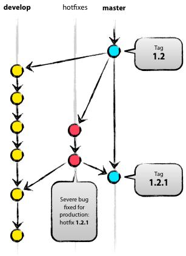
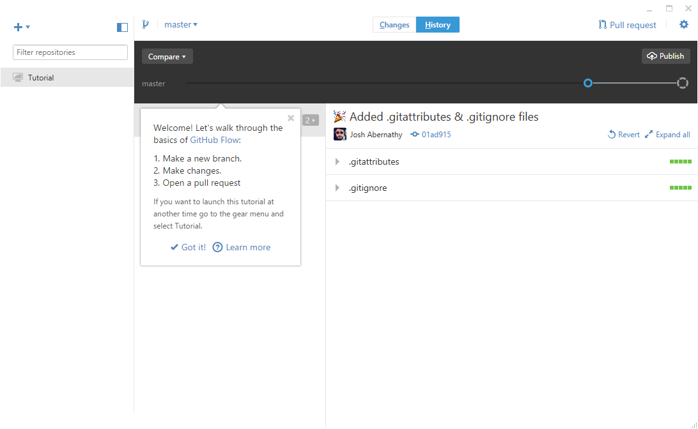
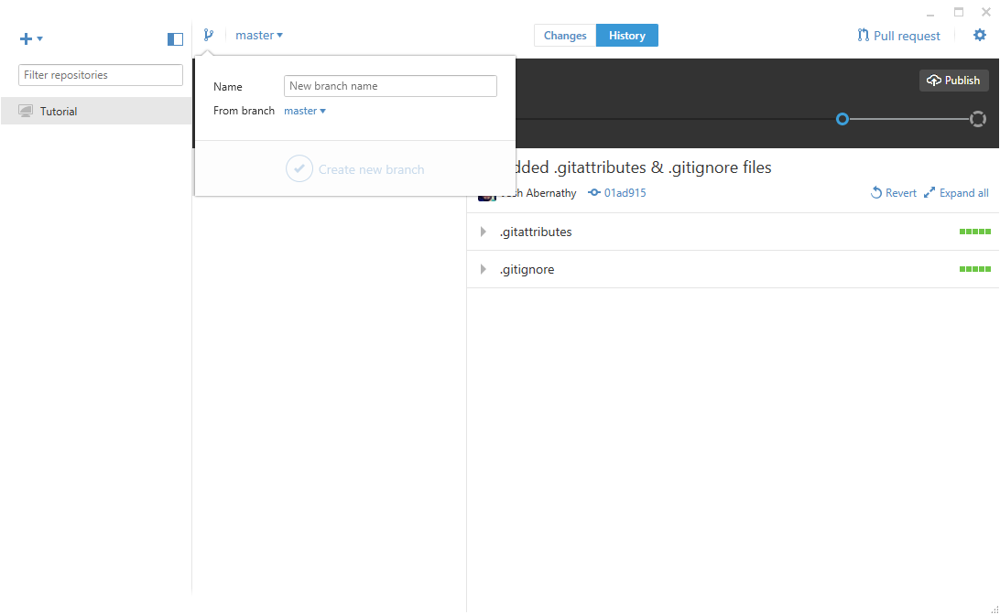
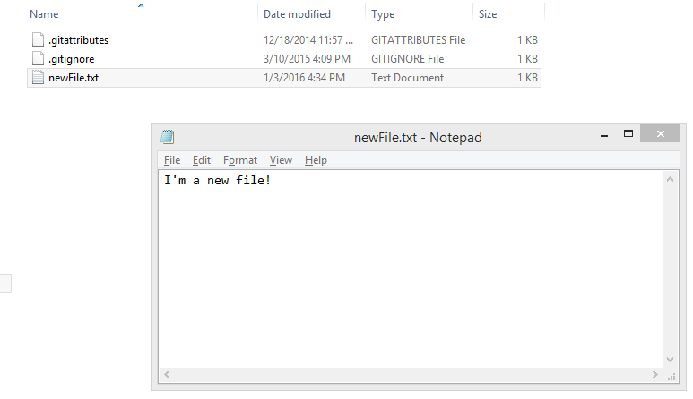
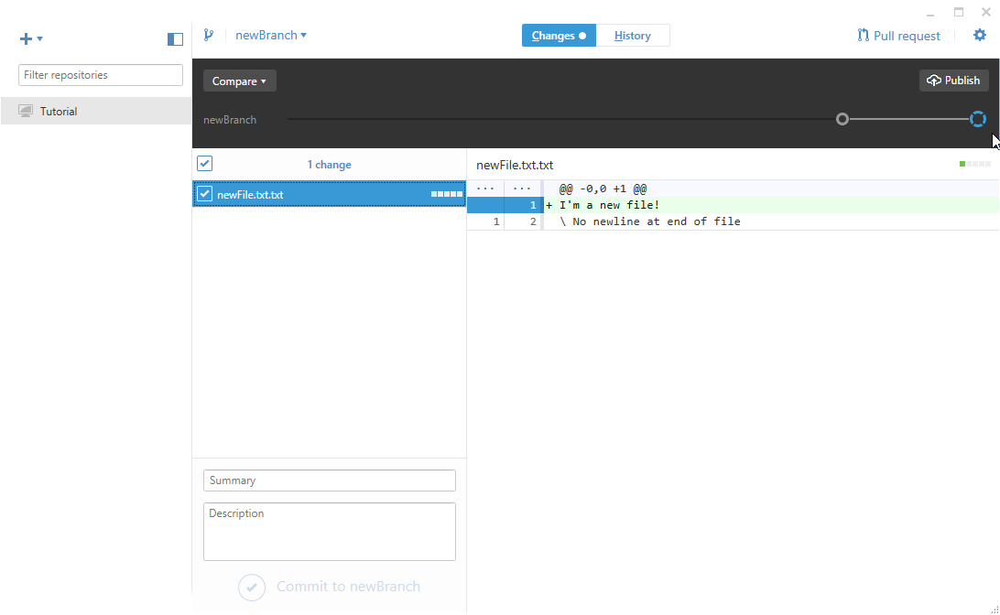
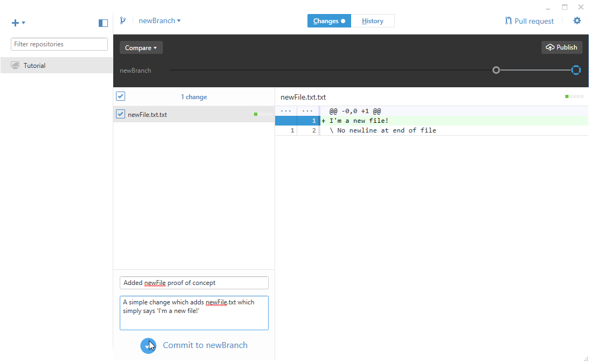
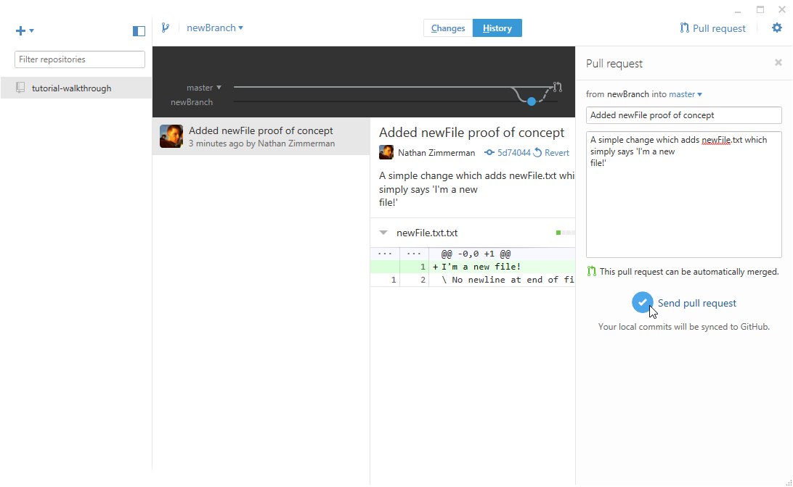

#Using git and the github client

####Git and GitHub
Git is a powerful tool used to manage the versioning, distribution, and merging of collections of files (this collection of files plus metadata which facilitates versioning is referred to as a git repository - [an example repository](https://github.com/geotrellis/geotrellis)). Nearly all workplaces in which  groups of people who need to collaborate on a programming project will expect a level of proficiency in git. To this end, we'll be using git for as much of this course as we can.  

[GitHub](https://github.com) is a service for storing git repositories. Repositories may be stored freely so long as they are publicly visible. Consequently, GitHub is the home of most open source software currently being written.  

Professionally, the command line client is most commonly used to manage the creation, modification, and transmission of repositories. We will be using a graphical client written by GitHub so that we can focus in on a few key concepts that are sufficient to use git in 99% of the cases you'll encounter.

####Git terminology
*Repository* - A collection of files along with metadata which allows git to keep 'snapshots' of all the changes these files have undergone. Git allows us to travel back in time to previous edits if we've made a huge blunder, to examine each change a collection of files has undergone in detail, and to associate a set of changes with the person who made them.  

*Branch* - An organizational concept for 'snapshots' of a repository; a collection of commits. Typically, a software project will have a 'master' branch along with a host of supplementary branches on which developers work with the intention of 'merging' the changes they've made onto 'master'.  

*Commit* - A snapshot of the repository at some point in time. After changing a set of files, you can commit the changes you would like to keep. These changes will be part of a new 'snapshot' of the repository.

*Merge* - Joining two collections of files together without duplication of shared elements. If we both make changes to `index.html` in a project we're working on and neither of us change any of the other files, a merge between your branch and mine will attempt to keep both of our changes when writing the merged `index.html`.  

*Merge conflict* - The cause of a failed merge. Merges are typically done automatically by git. There are instances in which the algorithm is unable to successfully complete a merge and we'll be asked to manually merge some portions of our code. This will happen any time we both make changes to the same lines of a file before attempting to merge our changes together - from the perspective of git, there's no clear way to determine a winning change.  

*Pull request* - A request to pull one branch into another, merging their changes. After writing a new feature, testing it, and deciding that it is ready to be used, we'll normally make a 'pull request' on the 'master' branch to incorporate the changes we've made.  

####Setup
To use the github client, it is first necessary to [create an account](https://github.com/join). You'll be using this account to access content stored on github. After [downloading](https://desktop.github.com) and installing the github client, you'll be asked to enter either your github username or your email along with your password.  

####Tutorial
Upon logging into the GitHub client, you'll have the option of completing a tutorial on the most common method for updating a collection of files.  

These three steps are:  
1. Make a new branch (copy the files we would like to make edits to into a new, working branch which is safe to change)  

2. Make changes (change files on our working branch and commit the ones you want to keep)  

3. Open a pull request (request that our working branch changes be incorporated back onto the main branch)  

Now, simply rinse and repeat to safely collaborate on changes to any project stored in a git repository.
